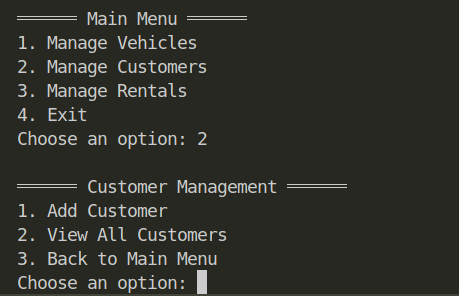

# Vehicle Rental System

Welcome to the **Vehicle Rental System**! This project is a Java-based application designed to manage vehicle rentals, customers, and rental records. It is built with a focus on **Object-Oriented Design Principles**, **Design Patterns**, and **Quality Assurance** to ensure a robust and maintainable system.

---

## Table of Contents

1. [Project Overview](#project-overview)
2. [Architecture](#architecture)
3. [Functionalities](#functionalities)
4. [Object-Oriented Design Principles](#object-oriented-design-principles)
5. [Design Patterns](#design-patterns)
6. [Quality Assurance](#quality-assurance)
7. [Security and Authentication](#security-and-authentication)
8. [How to Run the Application](#how-to-run-the-application)
9. [UI References](#ui-references)

---

## Project Overview

The **Vehicle Rental System** is a command-line application that allows administrators to manage:
- **Vehicles**: Add, update, view, and remove vehicles.
- **Customers**: Add, update, view, and remove customers.
- **Rentals**: Add, view, and search rental records.

The system uses **text files** for data persistence and adheres to **clean coding practices** for maintainability and scalability.

---

## Architecture

The project follows a **layered architecture**:

1. **Presentation Layer**:
   - [`VehicleRentalSystem`](app/src/main/java/vehicle_rental_system/VehicleRentalSystem.java): The main entry point of the application. Handles user interaction and input validation.

2. **Service Layer**:
   - [`AdminService`](app/src/main/java/vehicle_rental_system/AdminService.java): Contains business logic for managing vehicles, customers, and rentals. Acts as a bridge between the presentation layer and the repositories.

3. **Repository Layer**:
   - [`VehicleRepository`](app/src/main/java/vehicle_rental_system/repos/VehicleRepository.java): Manages vehicle data in `vehicles.txt`.
   - [`CustomerRepository`](app/src/main/java/vehicle_rental_system/repos/CustomerRepository.java): Manages customer data in `customers.txt`.
   - [`RentalRepository`](app/src/main/java/vehicle_rental_system/repos/RentalRepository.java): Manages rental data in `rentals.txt`.

4. **Domain Layer**:
   - Classes like [`Vehicle`](app/src/main/java/vehicle_rental_system/Vehicle.java), [`Car`](app/src/main/java/vehicle_rental_system/Car.java), [`Bike`](app/src/main/java/vehicle_rental_system/Bike.java), [`Truck`](app/src/main/java/vehicle_rental_system/Truck.java), [`Customer`](app/src/main/java/vehicle_rental_system/Customer.java), and [`Rental`](app/src/main/java/vehicle_rental_system/Rental.java) represent the core entities of the system.

---

## Functionalities

### Vehicle Management
- Add vehicles (Car, Bike, Truck) with specific attributes.
- View available and rented vehicles.
- Update vehicle details.
- Remove vehicles.

### Customer Management
- Add new customers.
- View all customers.
- Update customer details.
- Remove customers.

### Rental Management
- Add rental records.
- View all rental records.
- Search rentals by customer ID or vehicle ID.

---

## Object-Oriented Design Principles

The project adheres to the following **OO principles**:

1. **Encapsulation**:
   - All fields in domain classes (e.g., `Vehicle`, `Customer`, `Rental`) are private, with public getters and setters.
   - Data manipulation is restricted to specific methods.

2. **Inheritance**:
   - `Car`, `Bike`, and `Truck` inherit from the abstract class `Vehicle`.
   - Common attributes and methods are defined in `Vehicle`, while specific attributes are implemented in the subclasses.

3. **Polymorphism**:
   - The `getDetails()` method in `Vehicle` is overridden in `Car`, `Bike`, and `Truck` to provide specific details for each type.

4. **Abstraction**:
   - The `Vehicle` class is abstract, ensuring that only specific vehicle types (Car, Bike, Truck) can be instantiated.

---

## Design Patterns

### 1. **Factory Pattern**
- **Where**: [`VehicleFactory`](app/src/main/java/vehicle_rental_system/VehicleFactory.java)
- **Why**: Simplifies the creation of `Vehicle` objects (Car, Bike, Truck) based on the type.
- **Justification**: Centralizes object creation logic, making the code more maintainable and extensible.

### 2. **Singleton Pattern**
- **Where**: [`AdminService`](app/src/main/java/vehicle_rental_system/AdminService.java)
- **Why**: Ensures a single instance of the service layer to manage the application's business logic.
- **Justification**: Prevents multiple instances of `AdminService`, ensuring consistent state across the application.

### 3. **Repository Pattern**
- **Where**: [`VehicleRepository`](app/src/main/java/vehicle_rental_system/repos/VehicleRepository.java), [`CustomerRepository`](app/src/main/java/vehicle_rental_system/repos/CustomerRepository.java), [`RentalRepository`](app/src/main/java/vehicle_rental_system/repos/RentalRepository.java)
- **Why**: Separates data access logic from business logic.
- **Justification**: Improves code modularity and makes it easier to switch to a database in the future.

---

## Quality Assurance

### Code Testing
- **Unit Tests**: Implemented using **JUnit 5** and **Mockito**.
- **Test Coverage**:
  - Authentication logic in `AdminService`.
  - CRUD operations in repositories.
  - Vehicle creation logic in `VehicleFactory`.

### Verification
- **Manual Testing**: The application was tested for edge cases, such as invalid inputs and missing data.
- **Error Handling**: Comprehensive error messages are displayed for invalid operations (e.g., "Vehicle not found").

---

## Security and Authentication

### Authentication
- **Admin Login**: The system requires a username and password to access the main menu.
- **Implementation**: The `Admin` class handles authentication by validating credentials.

### Security Measures
- **Password Management**: Passwords are stored securely in memory (not in plain text files).
- **Input Validation**: User inputs are validated to prevent invalid data from being processed.

---

## How to Run the Application

1. **Clone the Repository**:
   ```bash
   git clone <repository-url>
   cd vehicle_rental_system
    ```
2. **Build the Project**:

    ```bash
    mvn clean install
    ```
3. **Run the Application**:
    ```bash
    java -cp target/vehicle_rental_system-1.0-SNAPSHOT.jar vehicle_rental_system.VehicleRentalSystem
    ```

4. **Login**: Enter the admin username and password when prompted.
    - Default credentials:
      - Username: `admin`
      - Password: `password123`

4. **Follow the on-screen instructions** to navigate through the application.
5. **Data Files**: The application uses text files (`vehicles.txt`, `customers.txt`, `rentals.txt`) for data persistence. Ensure these files are in the correct directory.
6. **Sample Data**: Sample data files are provided in the `resource` directory for testing purposes.

## UI References

### Main Menu


### Vehicle Management

### Customer Management

### Rental Management


Visi  for more screenshots of the application.

---

## Conclusion
The **Vehicle Rental System** is a comprehensive application that demonstrates the principles of Object-Oriented Design, Design Patterns, and Quality Assurance. It provides a solid foundation for managing vehicle rentals and can be extended with additional features in the future.
Feel free to explore the codebase, and contribute to its development!


Author: **Muhammad Yousuf**
Date: **Apr 20, 2025**

## Happy Coding!

